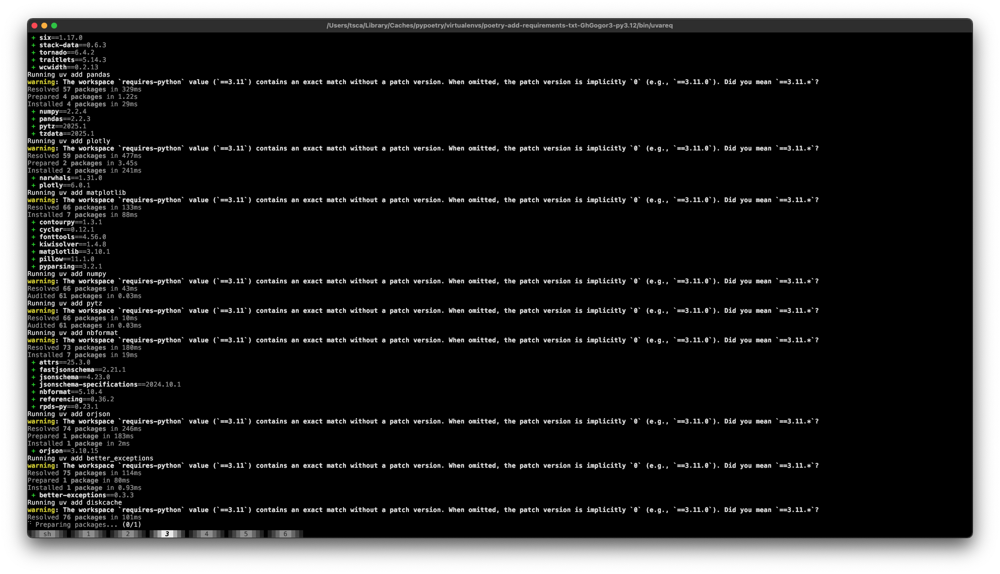

# poetry-add-requirements.txt & uv-add-requirements.txt

Add dependencies specified in requirements.txt file(s) to your Poetry / UV project

- [poetry-add-requirements.txt \& uv-add-requirements.txt](#poetry-add-requirementstxt--uv-add-requirementstxt)
  - [Features](#features)
  - [Installation](#installation)
    - [uv](#uv)
    - [pipx](#pipx)
    - [pip](#pip)
  - [Usage](#usage)
    - [For poetry](#for-poetry)
    - [For uv](#for-uv)
    - [Usage examples and tips](#usage-examples-and-tips)
  - [Screenshot](#screenshot)
  - [Develop](#develop)

## Features

- Auto detect charset of requirements.txt file(s) and feed normalized dependency specs to `poetry` / `uv`.
- Stop on first `poetry / uv add` error.
- Ignore dependency version requirements specified in requirements.txt file(s).
- Ignore errors when installing individual dependencies.
- Pass arbitrary arguments to `poetry / uv add` after `--` at the end of the command.

## Installation

The package name are PyPI is `poetry-add-requirements.txt` or `uv-add-requirements.txt`, both are equivalent.

They both provide these 4 commands / executables: `poeareq, poetry-add-requirements.txt, uv-add-requirements.txt, uvareq`

`poeareq` is just a shorthand for `poetry-add-requirements.txt`, and `uvareq` is just a shorthand for `uv-add-requirements.txt`.

### uv

This is the fastest way to install, or use without permanent installation.

```
$ uv tool install poetry-add-requirements.txt
```

### pipx

This is the recommended installation method.

```
$ pipx install poetry-add-requirements.txt
```

### [pip](https://pypi.org/project/poetry-add-requirements.txt/)

```
$ pip install poetry-add-requirements.txt
```

## Usage


### For poetry

Run `poetry-add-requirements.txt`, optionally specify your requirements.txt files and `--dev` for dev dependencies.

`poeareq` is provided is an alias to `poetry-add-requirements.txt`.

```
$ poeareq --help

usage: poetry-add-requirements.txt [-h] [-D] [-I] [-i] [-n] [-p ...] [-V]
                                   [requirements.txt file(s) ...]

Add dependencies specified in requirements.txt to your Poetry project

positional arguments:
  requirements.txt file(s)
                        Path(s) to your requirements.txt file(s) (default:
                        requirements.txt)

options:
  -h, --help            show this help message and exit
  -D, --dev             Add to development dependencies (default: False)
  -I, --ignore-version-requirements
                        Ignore dependency version requirements in
                        requirements.txt file(s) (default: False)
  -i, --ignore-errors   Ignore errors (default: False)
  -n, --dry-run         Dry run, do not add dependencies (default: False)
  -p ..., --poetry-args ...
                        Additional arguments to pass to Poetry, put this at
                        the END of the command (default: None)
  -V, --version         show program's version number and exit

```

### For uv

Same as above, just change the command to `uv-add-requirements.txt` or `uvareq` (they are equivalent).

### Usage examples and tips

For examples, see [test-extra-args.sh](./tests/test-extra-args.sh).

Tips:
- Put all req files before any options
- Put `-p`, `--poetry-args` at the end of the command
- Pass `-n`, `--dry-run` to see the poetry commands that would be run

## Screenshot

Running `uv-add-requirements.txt` without extra args:



## Develop

```
$ git clone https://github.com/tddschn/poetry-add-requirements.txt.git
$ cd poetry-add-requirements.txt
$ poetry install
```